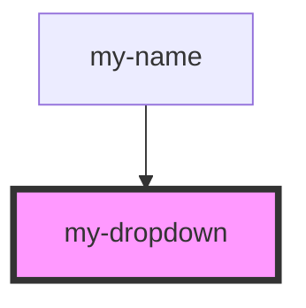

# my-dropdown

<!-- Auto Generated Below -->

## Properties

| Property   | Attribute   | Description | Type      | Default |
| ---------- | ----------- | ----------- | --------- | ------- |
| `isToggle` | `is-toggle` |             | `boolean` | `false` |
| `myTitle`  | `my-title`  |             | `string`  | `''`    |

## Events

| Event    | Description | Type               |
| -------- | ----------- | ------------------ |
| `toggle` |             | `CustomEvent<any>` |

## Dependencies

### Used by

 - [my-name](../my-name)

### Graph

----------------------------------------------

*Built with [StencilJS](https://stenciljs.com/)*
